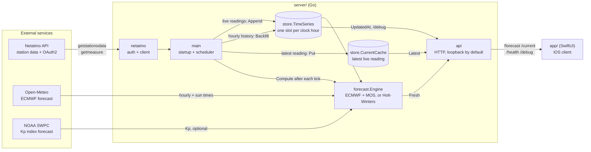
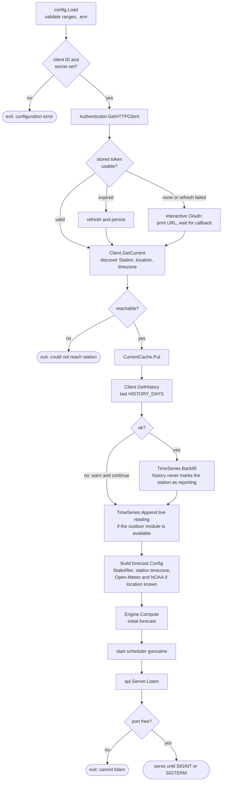
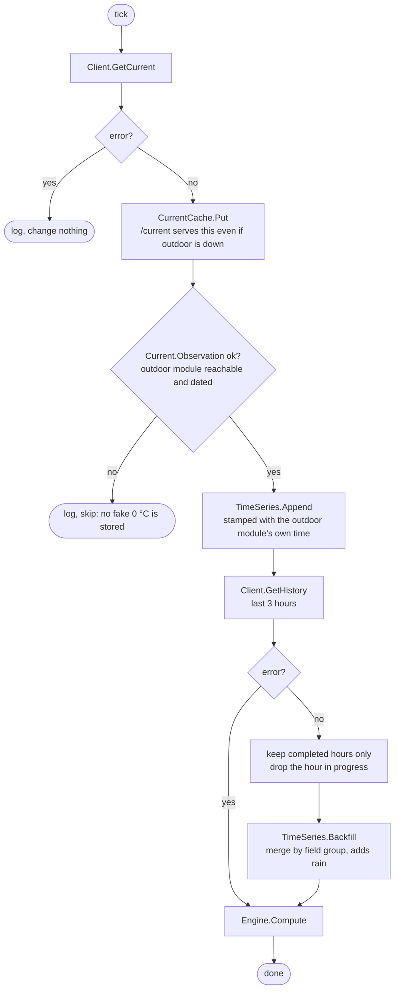
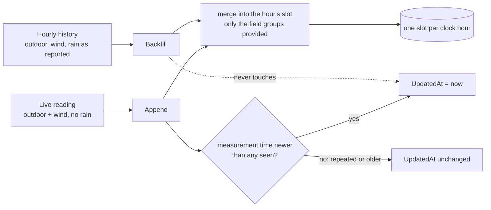
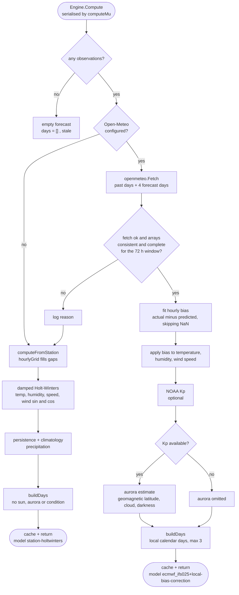
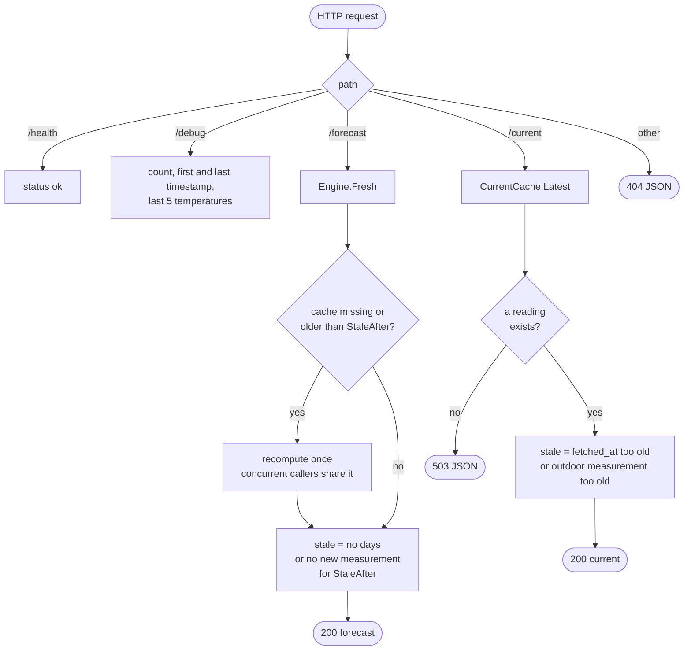

# Architecture

mycast is a Go service that reads a Netatmo weather station, blends an ECMWF forecast with a bias correction learned from the station's own readings, and serves the result as JSON to a SwiftUI app.

This page shows how the pieces fit and how data moves. For the forecasting maths see [FORECAST.md](FORECAST.md); for setup and the API reference see [README.md](README.md).

## System overview

Two rules shape the layout:

- **Requests never call Netatmo.** The scheduler is the only thing that talks to it; `/current` and `/forecast` are answered from memory.
- **The Netatmo client is stateless.** What it learns about the station comes back as a `netatmo.Station` value on each reading, and history calls take one as an argument. Caching lives in `store`, owned by `main`.

## Packages

| Package | Responsibility | Depends on |
|---|---|---|
| `main` | Startup order, the scheduler tick, wiring | everything below |
| `config` | `.env` + environment loading, validation of ranges | none |
| `netatmo` | OAuth2 flow and token file; `GetCurrent`, `GetHistory`; the `Observation`, `Current`, `Station` types | `oauth2` |
| `store` | `TimeSeries` (hourly buffer, merge by field group) and `CurrentCache` | `netatmo` |
| `openmeteo` | ECMWF hourly forecast and sunrise/sunset | none |
| `noaa` | Kp index forecast for the aurora estimate | none |
| `forecast` | `Engine`: forecast paths, local-day bucketing, staleness | `store`, `netatmo`, `openmeteo`, `noaa` |
| `api` | Routes, JSON wire types, `stale` flags, graceful shutdown | `forecast`, `store`, `netatmo` |

## Startup

`main` runs these steps in order. A failure at any step except history exits the process.

## Scheduler tick

Every `FETCH_INTERVAL_MIN` the scheduler runs `fetchAndUpdate`. It is the only writer of live data.

### How data is written to the store

Observations say which field groups they really carry (`Observation.Has`). A write only overwrites the groups it provides, so an hour with no wind aggregate keeps its stored wind.

| | `Append` | `Backfill` |
|---|---|---|
| Source | live reading each tick | Netatmo hourly aggregates |
| Rain | never (a rolling hour sum would double-count) | yes, the authoritative clock-hour total |
| Order | ignores hours older than the newest | inserts anywhere |
| Counts as "station reporting" | only for a newer measurement | never |

## Forecast computation

`Engine.Compute` always produces a forecast. The ECMWF path is preferred; any failure falls back to the station-only model and is logged.

`buildDays` groups hours by the **station's local calendar day**, so the first day holds only the hours remaining today. Darkness for each hour is decided from the most recent sunrise or sunset before it.

## Serving requests

Every response is JSON, including `404`/`405`. Only `GET` and `HEAD` are accepted.

`StaleAfter` is `2 × FETCH_INTERVAL_MIN`, never below 30 minutes, because Netatmo modules report roughly every ten minutes. The two `stale` flags are defined differently on purpose:

| Endpoint | `stale` is true when |
|---|---|
| `/forecast` | there is no data, or the store has seen no *newer measurement* for `StaleAfter` |
| `/current` | `fetched_at` is older than `StaleAfter`, **or** `outdoor_timestamp` is |

Both still serve the last good data; clients are expected to show a warning rather than hide it.

## Invariants worth knowing

- **One slot per clock hour.** Timestamps are floored to the hour, so a week of capacity really is a week of wall-clock time.
- **Readings are dated by the module that measured them.** The base station's clock is not used for outdoor values.
- **Zero means "no data" only where the type says so.** Use `Observation.Has` to tell a measured calm from a missing wind value.
- **Loopback by default.** The API has no authentication, so `BIND_ADDR` defaults to `127.0.0.1`.
- **Fixtures are shared with the app.** `app/MyCastTests/Fixtures/*.json` are generated by the Go golden tests (`go test ./forecast ./api -run Golden -update`) and decoded by the Swift tests, so a response change one side can't read fails on one of them.
