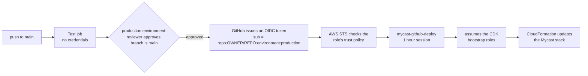
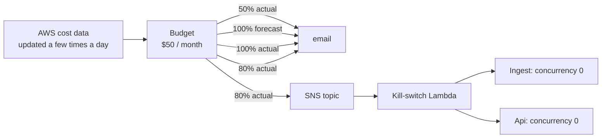

# Deploying mycast to AWS

This runs mycast as two Lambda functions and one DynamoDB table, with no server to keep alive. It is defined with the AWS CDK in [`cdk/`](cdk/). The same code still runs locally as a single process (`cd server && go run .`); see [ARCHITECTURE.md](../ARCHITECTURE.md) for how the two modes share their pipeline.

## What gets created

| Resource | Purpose |
|---|---|
| **`Ingest` Lambda** (arm64, 256 MB, 60 s) | Every `fetchIntervalMin` minutes: reads the station, folds the reading into the stored series, recomputes the forecast and saves the results |
| **`Api` Lambda** (arm64, 128 MB, 10 s) behind a **Function URL** | Serves `/forecast`, `/current`, `/health`, `/debug` from DynamoDB. Never calls Netatmo. Requires a bearer token |
| **DynamoDB table** (on-demand, TTL) | Observations, the latest reading, the forecast, staleness state, and the Netatmo OAuth token |
| **EventBridge Scheduler** schedule | Invokes `Ingest` |
| **Parameter Store** SecureStrings (created by you) | Netatmo client ID and secret, and the API token |

Nothing runs in a VPC, so there is no NAT gateway and no public IPv4 charge.

## Cost

About **3 cents a month** at list price, and about 1 cent once the always-free tiers are applied, for a station polled every 30 minutes and an app refreshing 100 times a day. Prices are from the AWS price list for eu-north-1 (Stockholm), 2026-10.

| Usage | List price | After free tiers |
|---|---|---|
| 30 min polling, 100 refreshes/day | $0.030 | $0.012 |
| 10 min polling | $0.084 | $0.034 |
| 1,000 refreshes/day | $0.059 | $0.023 |

Excluded: VAT, and anything else running in your account. The estimate rests on measured sizes: the stored forecast is about 3 KB (27 KB of JSON, gzipped), so one run is roughly 9 write units.

## Prerequisites

- An AWS account and credentials in your environment (`aws sts get-caller-identity` works), with a default region. `eu-north-1` (Stockholm) is the nearest to Finland.
- Go, Node.js 20+, and the AWS CLI.
- Your Netatmo app's client ID and secret (the same ones as the local `.env`).

## Deploy

### 1. Store the secrets

Secrets live in Parameter Store, not in the functions' environment, where anyone able to read their configuration could see them. The prefix must match `ssmPrefix` in [`cdk/cdk.json`](cdk/cdk.json) (default `/mycast/`).

```bash
aws ssm put-parameter --type SecureString --name /mycast/netatmo-client-id     --value '<your Netatmo client id>'
aws ssm put-parameter --type SecureString --name /mycast/netatmo-client-secret --value '<your Netatmo client secret>'
aws ssm put-parameter --type SecureString --name /mycast/api-token             --value "$(openssl rand -base64 32)"
```

These use the account's default `aws/ssm` key, which the functions can use without further permissions. If you encrypt them with a key of your own, also grant the functions `kms:Decrypt` on it.

The `api-token` is what the app sends as a bearer token. Read it back when you need it:

```bash
aws ssm get-parameter --with-decryption --name /mycast/api-token --query Parameter.Value --output text
```

### 2. Build and deploy

```bash
cd deploy/cdk
npm ci
npx cdk bootstrap aws://<ACCOUNT_ID>/<REGION> -c budgetEmail=none   # once per account and region
npm run deploy -- -c budgetEmail=you@example.com   # builds the Go binaries, then cdk deploy
```

`cdk deploy` prints the outputs you need: `ApiUrl`, `TableName`, `IngestFunctionName` and `AuthorizeCommand`.

Settings come from CDK context (`cdk.json`, or `-c name=value`):

| Context | Default | Meaning |
|---|---|---|
| `ssmPrefix` | `/mycast/` | Parameter Store prefix |
| `historyDays` | `7` | Days of hourly history to keep (2–30) |
| `fetchIntervalMin` | `30` | Minutes between runs (1–1440) |
| `openMeteoEnabled` | `true` | Blend in the ECMWF forecast |
| `budgetEmail` | **required** | Where spending alerts go. `none` deploys without a spending guard. Passed at deploy time, never stored in the repo |
| `budgetLimitUsd` | `50` | Monthly limit in USD (Budgets supports only USD) |
| `killAtPercent` | `80` | Share of the limit, in actual spend, at which both functions are stopped |
| `apiReservedConcurrency` | unset | A ceiling on how much the public API function can ever run. Needs the account's Lambda concurrency limit to be above 10 (new accounts start at 10, and AWS refuses any reservation then: "decreases account's UnreservedConcurrentExecution below its minimum value of 10"); request a quota increase first |
| `ingestReservedConcurrency` | unset | Reserve concurrency for `Ingest`. Left off because a new account's low concurrency limit can make the deploy fail; overlap is prevented by the timeout, the schedule, and having no retries |

### 3. Authorise with Netatmo, once

OAuth needs a browser, so this runs on your machine and writes the token into the table:

```bash
cd server
go run ./cmd/mycast-auth -table <TableName>
```

Open the printed URL and approve. The Netatmo app's redirect URI stays `http://localhost:8080/auth/callback`: the callback is received locally, and only the resulting token goes to AWS. `Ingest` then keeps the rotating refresh token current by itself.

If Netatmo ever revokes access, `Ingest` fails and logs `run mycast-auth to authorise again`. Run the command again.

### 4. Check it

```bash
aws lambda invoke --function-name <IngestFunctionName> --log-type Tail /dev/null \
  --query LogResult --output text | base64 --decode

TOKEN=$(aws ssm get-parameter --with-decryption --name /mycast/api-token --query Parameter.Value --output text)
curl -s -H "Authorization: Bearer $TOKEN" <ApiUrl>/forecast | head -c 400
```

The first run loads the whole history window, so it writes a few hundred items; later runs write a handful.

### 5. Point the app at it

```bash
cp app/Config/Secrets.xcconfig.example app/Config/Secrets.xcconfig
# set MYCAST_API_BASE_URL to <ApiUrl> and MYCAST_API_TOKEN to the api-token
```

`Secrets.xcconfig` is git-ignored. The values flow into `Info.plist` as `MyCastAPIBaseURL` and `MyCastAPIToken`. Rebuild the app.

## Deploying from GitHub Actions

[`.github/workflows/ci-deploy.yml`](../.github/workflows/ci-deploy.yml) tests every push and pull request, and deploys from `main` after you approve it. It uses **OIDC**: GitHub proves its identity to AWS and receives credentials that last an hour, so there are no AWS keys stored in GitHub at all. (Long-lived access keys in repository secrets are the weaker choice: a leaked one works until you notice.)



| Event | What runs | AWS access |
|---|---|---|
| Pull request (including from a fork) | `gofmt`, `vet`, `go test -race`, CDK tests, build, `cdk synth` | none |
| Push to `main` | the same, then **deploy** once the `production` environment is approved | the role, for one hour |
| Manual run from `main` | same as a push | same |
| Anything else | nothing deploys | none |

### One-time setup

**1. Create the role in AWS.** Do this once from your machine, with whatever administrator credentials you use today. It is a plain CloudFormation template rather than part of the CDK app on purpose: the pipeline must not be able to rewrite its own trust.

```bash
# An account can have only one GitHub OIDC provider. If this lists one, pass its ARN below.
aws iam list-open-id-connect-providers

# GitHub puts numeric IDs in the token's subject, so the role must be told them:
curl -s https://api.github.com/repos/<owner>/<repo> | python3 -c "import sys,json; d=json.load(sys.stdin); print('GitHubOwnerId=%s GitHubRepoId=%s' % (d['owner']['id'], d['id']))"

aws cloudformation deploy \
  --template-file deploy/github-oidc.yaml \
  --stack-name mycast-github-oidc \
  --capabilities CAPABILITY_NAMED_IAM \
  --parameter-overrides GitHubOwner=<owner> GitHubRepo=<repo> GitHubOwnerId=<id> GitHubRepoId=<id>
  # add ExistingOidcProviderArn=arn:aws:iam::... if the account already has the GitHub provider

aws cloudformation describe-stacks --stack-name mycast-github-oidc \
  --query 'Stacks[0].Outputs[?OutputKey==`DeployRoleArn`].OutputValue' --output text
```

The role trusts exactly `repo:<owner>@<owner-id>/<repo>@<repo-id>:environment:production`: a fork, a pull request, or a job on another branch has a different subject and is refused, and because the IDs are in it, a renamed or re-registered account can't impersonate you.

**2. Bootstrap CDK** (once per account and region), as in step 2 of the manual deploy: `cd deploy/cdk && npm ci && npx cdk bootstrap aws://<ACCOUNT_ID>/<REGION> -c budgetEmail=none`. (The CDK app refuses to run without a `budgetEmail`, and bootstrapping runs it; `none` is fine here, since bootstrapping creates no budget.) Create the three Parameter Store secrets (step 1 above) too, if you have not.

**3. Configure GitHub** (repository Settings):

| Where | Setting |
|---|---|
| Environments → New `production` | **Required reviewers**: yourself. **Deployment branches**: selected branches, `main` only |
| Secrets and variables → Actions → *Variables* | `AWS_DEPLOY_ROLE_ARN` = the role ARN from step 1; `AWS_REGION` = e.g. `eu-north-1` |
| Environments → `production` → *Environment secrets* | `BUDGET_EMAIL` = the address for spending alerts. A secret, so it is masked in the public logs; **the deploy fails without it** (see "Spending guard") |
| Branches → protect `main` | require the **Test** check to pass before merging |

The role ARN and region are *variables* because neither is sensitive. Create them as **repository** variables, not as variables of the `production` environment: the deploy job's `if:` can only see repository variables, so one defined only on the environment makes the job skip itself. (The run says so in its summary.) The only secret GitHub holds is the alert email address. The Netatmo secret and the API token stay in Parameter Store, and the Netatmo OAuth step (`mycast-auth`) remains a local, manual one.

**4. Push to `main`.** The Test job runs, the Deploy job waits for your approval in the Actions tab, then deploys.

The Deploy job is skipped while `AWS_DEPLOY_ROLE_ARN` is unset, so you can push the workflow before any of this exists: it just runs the tests. Set the environment's protections (step 3) **before** you create the role (step 1) and set that variable. A workflow that references an environment which doesn't exist makes GitHub create it with no protection rules, and this ordering keeps that from ever mattering.

### What this does not limit

Be clear-eyed about where the protection is:

- **The role can only hand over to CDK's bootstrap roles**, but those do the deploying, and by default CDK's bootstrap gives CloudFormation an execution role with **AdministratorAccess**. So a deployment can create anything in the account. The control that matters is therefore *who can get a change onto `main` and approved*, not IAM scoping: keep the reviewer requirement, the `main`-only deployment branch rule, and branch protection.
- **To narrow it further**, bootstrap with a scoped execution policy (`cdk bootstrap --cloudformation-execution-policies <ARN>`) covering only DynamoDB, Lambda, Logs, Scheduler and the IAM roles this stack creates. That is not provided here because it could not be tested against a real account.
- **Third-party actions are pinned to commit SHAs**, so a re-pointed tag can't change what runs. Update them deliberately.
- **Local `cdk deploy` still works** and bypasses all of this. Once the pipeline runs, consider removing long-lived local keys for this account.

## Spending guard

**AWS has no hard spending cap.** What this stack has instead is a budget that warns you early and an automatic kill switch, which together bound the damage to roughly the limit plus a little overshoot.



| Alert | When | Goes to |
|---|---|---|
| Early warning | 50% of the limit spent | email |
| **Kill switch** | **80% of the limit spent ($40)** | email + the kill-switch function |
| Limit reached | 100% spent | email |
| Forecast | spend is forecast to pass 100% | email |

The kill switch sets reserved concurrency to **0** on the ingest and API functions, which makes Lambda refuse to run them. It is allowed to do exactly that and nothing else (`lambda:PutFunctionConcurrency`, on those two functions). The app then gets errors and shows no data, which is the point.

**After it fires**, look at what happened (Cost Explorer, the functions' logs), then reset:

```bash
# the exact commands are printed as the ResetCommand stack output
aws lambda delete-function-concurrency --function-name <IngestFunctionName>
aws lambda delete-function-concurrency --function-name <ApiFunctionName>
```

Resetting is manual on purpose. To check the wiring without stopping anything, invoke the kill switch with `{"dryRun": true}`.

**What this does not do**
- **It isn't instant.** AWS cost data lags by hours, so the switch is set at 80% to leave room, not at 100%. A very fast runaway could overshoot.
- **The limit is in USD.** Budgets support no other currency. $50 stays under €50 as long as the euro is worth at least a dollar.
- **It guards these functions only.** Anything else you run in the account is outside it.
- **Realistic exposure is tiny.** Normal spend is about $0.03 a month. The only path an outsider can drive is the public API URL: requests without the token are rejected immediately and are not logged, and `apiReservedConcurrency` puts a ceiling on how much it can run at all.

The alert address is passed at deploy time as `budgetEmail`. The CDK app **refuses to deploy without it**, so a missing secret can't leave you unprotected by accident; `-c budgetEmail=none` is the explicit opt-out.

## How the API behaves here

- **No recompute on request.** `/forecast` returns what the last `Ingest` stored, with `stale` set from the station's own reporting. If `Ingest` stops, the forecast is served flagged stale, not quietly rebuilt from data that is just as old.
- **Auth.** Every route, including unknown paths, answers `401` without the bearer token. The function refuses to start without one.
- **Staleness window.** Twice `fetchIntervalMin`, never below 30 minutes (Netatmo modules report about every ten).

## Operations

| Task | How |
|---|---|
| Logs | CloudWatch log groups of the two functions (kept 14 days) |
| Change the interval or history | edit `cdk.json` or pass `-c`, then `npm run deploy` |
| Rotate the API token | `aws ssm put-parameter --overwrite ...`, then update `Secrets.xcconfig`; the function reads it at cold start, so redeploy or wait for the execution environment to recycle |
| Remove everything | `npx cdk destroy` (the table is retained, because it holds the Netatmo authorisation; delete it by hand if you want it gone), then `aws cloudformation delete-stack --stack-name mycast-github-oidc` |

## What is not here

- **No alarms.** A failing `Ingest` shows up as `stale: true` in the app. A CloudWatch alarm costs $0.10 a month, more than everything else here, so it is left to you.
- **No point-in-time recovery** on the table. Losing it costs one re-authorisation and a history reload.
- **No custom domain.** The Function URL is `*.lambda-url.<region>.on.aws`. A custom domain needs CloudFront in front.
- **Not yet deployed to a live account.** The stack synthesises, its assertions pass, and the Go logic is tested against in-memory fakes of DynamoDB and Parameter Store; the first real `cdk deploy` is the first time it meets AWS.

## Troubleshooting

**`Could not assume role with OIDC: Not authorized to perform sts:AssumeRoleWithWebIdentity`**

AWS rejected the token against the role's trust policy, and the message never says which part. CloudTrail does: look at the subject the token actually carried and compare it with the role's condition.

```bash
aws cloudtrail lookup-events --region <region> \
  --lookup-attributes AttributeKey=EventName,AttributeValue=AssumeRoleWithWebIdentity --max-results 1 \
  --query 'Events[0].CloudTrailEvent' --output text | python3 -c "import sys,json; print(json.load(sys.stdin)['userIdentity']['userName'])"

aws iam get-role --role-name mycast-github-deploy --query 'Role.AssumeRolePolicyDocument'
```

The first prints the token's subject (for example `repo:owner@123/name@456:environment:production`); the second shows what the role expects. They must be identical. The usual causes are the ID-qualified subject (above), a wrong owner, repo or environment name, or the job not running in the `production` environment.
